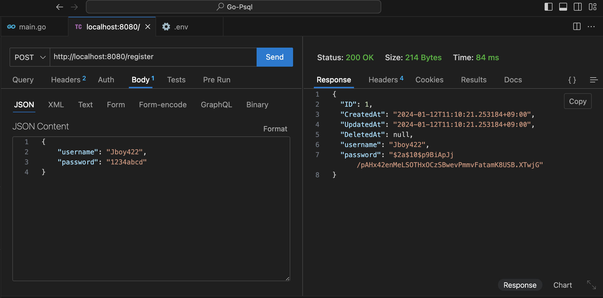

# Go言語でJWT認証を作成する
Postgresフォルダの中のREADMEを参考にローカルにDockerでPostgreSQLの環境構築して開発をする。

## 環境構築
1. 雛形を作る
```bash
go mod init jwt-auth
```
2. main.goに新規登録とログインのfunctionを作成
```go
package main

import (
	"log"

	"github.com/dgrijalva/jwt-go"
	"github.com/gin-gonic/gin"
	"github.com/jinzhu/gorm"
	"github.com/joho/godotenv"
	_ "github.com/lib/pq"
	"golang.org/x/crypto/bcrypt"

	"net/http"
	"os"
	"time"
)

type User struct {
	gorm.Model
	Username string `gorm:"type:varchar(100);unique_index" json:"username"`
	Password string `gorm:"type:varchar(100)" json:"password"`
}

var DB *gorm.DB

func main() {
	godotenv.Load()
	var err error
	DB, err = gorm.Open("postgres", os.Getenv("DATABASE_URL"))
	if err != nil {
		log.Fatalf("failed to connect database: %v", err)
	}
	defer DB.Close()

	DB.AutoMigrate(&User{})

	r := gin.Default()

	r.POST("/register", register)
	r.POST("/login", login)

	r.Run()
}

func register(c *gin.Context) {
	var user User
	if err := c.BindJSON(&user); err != nil {
		c.JSON(http.StatusBadRequest, gin.H{"error": err.Error()})
		return
	}
	hashedPassword, err := bcrypt.GenerateFromPassword([]byte(user.Password), bcrypt.DefaultCost)
	if err != nil {
		c.JSON(http.StatusInternalServerError, gin.H{"error": "Error while hashing password"})
		return
	}
	user.Password = string(hashedPassword)

	if err := DB.Save(&user).Error; err != nil {
		c.JSON(http.StatusInternalServerError, gin.H{"error": "Error while registering user"})
		return
	}
	c.JSON(http.StatusOK, user)
}

func login(c *gin.Context) {
	var user User
	if err := c.BindJSON(&user); err != nil {
		c.JSON(http.StatusBadRequest, gin.H{"error": err.Error()})
		return
	}

	var foundUser User
	if err := DB.Where("username = ?", user.Username).First(&foundUser).Error; err != nil {
		c.JSON(http.StatusInternalServerError, gin.H{"error": "Error while logging in"})
		return
	}

	if err := bcrypt.CompareHashAndPassword([]byte(foundUser.Password), []byte(user.Password)); err != nil {
		c.JSON(http.StatusUnauthorized, gin.H{"error": "Invalid password"})
		return
	}

	token := jwt.NewWithClaims(jwt.SigningMethodHS256, jwt.MapClaims{
		"username": user.Username,
		"exp":      time.Now().Add(time.Hour * 24).Unix(),
	})

	jwtSecret := os.Getenv("JWT_SECRET")
	if jwtSecret == "" {
		c.JSON(http.StatusInternalServerError, gin.H{"error": "JWT Secret not found"})
		return
	}

	tokenString, err := token.SignedString([]byte(jwtSecret))
	if err != nil {
		c.JSON(http.StatusInternalServerError, gin.H{"error": "Error while generating token"})
		return
	}

	c.JSON(http.StatusOK, gin.H{"token": tokenString})
}
```
3. パッケージの依存関係を追加する
```bash
go mod tidy
```

4. PostgreSQLが起動している状態で、ローカルサーバーを起動する
```bash
go run main.go
```

### 新規登録をする
新規登録のURLにPOSTしてデータベースにハッシュ化したパスワードとユーザー名が登録されていればOK



PostgreSQLの`users`テーブルの中身
```bash
postgres=# select * from users;
 id |          created_at           |          updated_at           | deleted_at | username |                           password  
                         
----+-------------------------------+-------------------------------+------------+----------+-------------------------------------
-------------------------
  1 | 2024-01-12 02:10:21.253184+00 | 2024-01-12 02:10:21.253184+00 |            | Jboy422  | $2a$10$p9BiApJj/pAHx42enMeLSOTHxOCzS
BwevPmmvFatamK8USB.XTwjG
(1 row)
```

### ログインをする
エンドポイントにHTTPリクエストを送って、JWT TOKENが表示されれば認証が成功していることになります。
